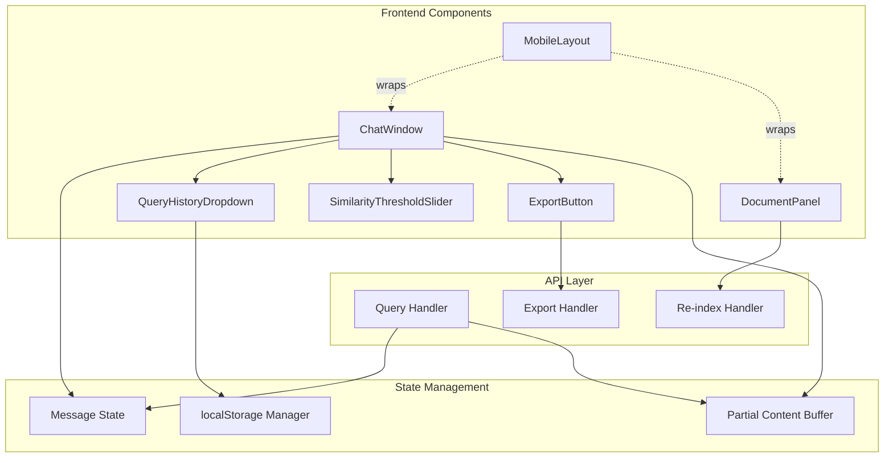
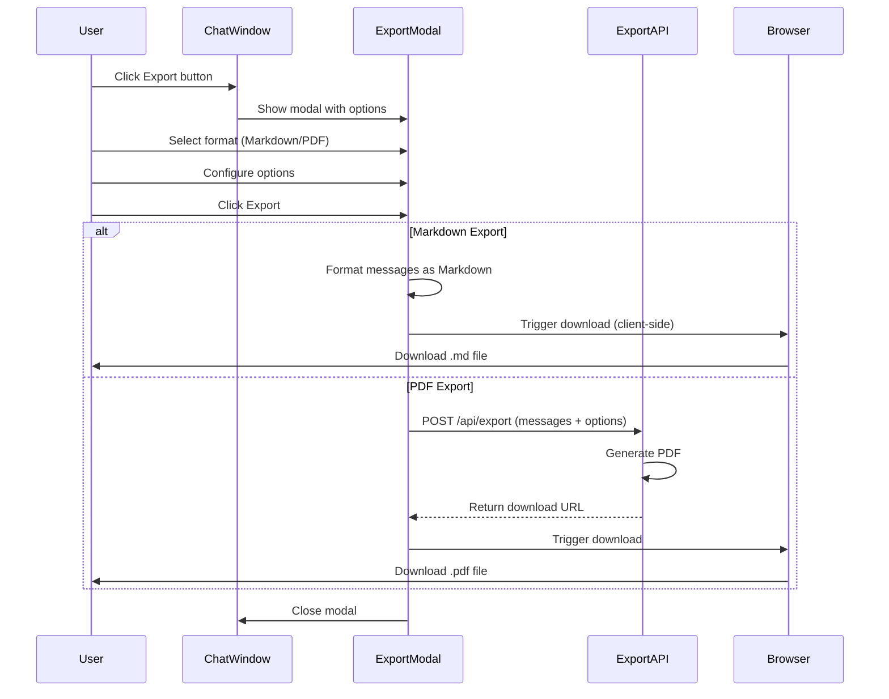
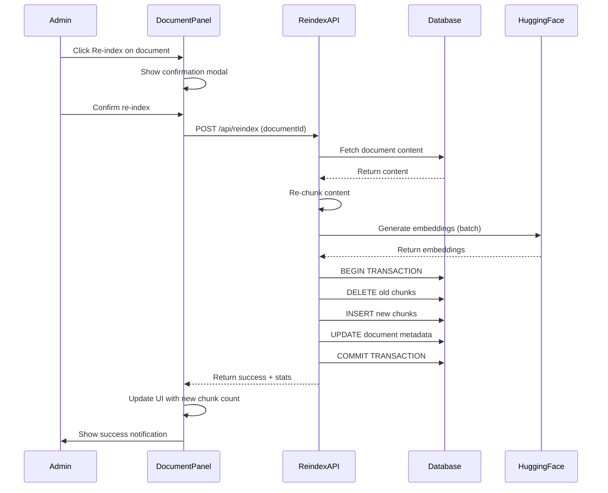
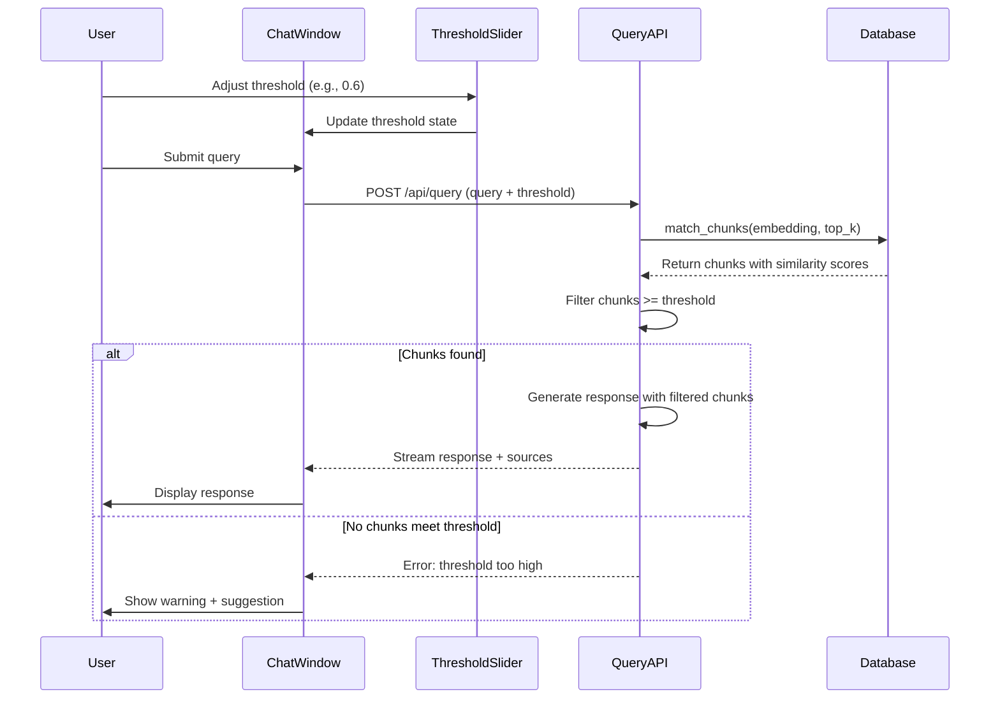
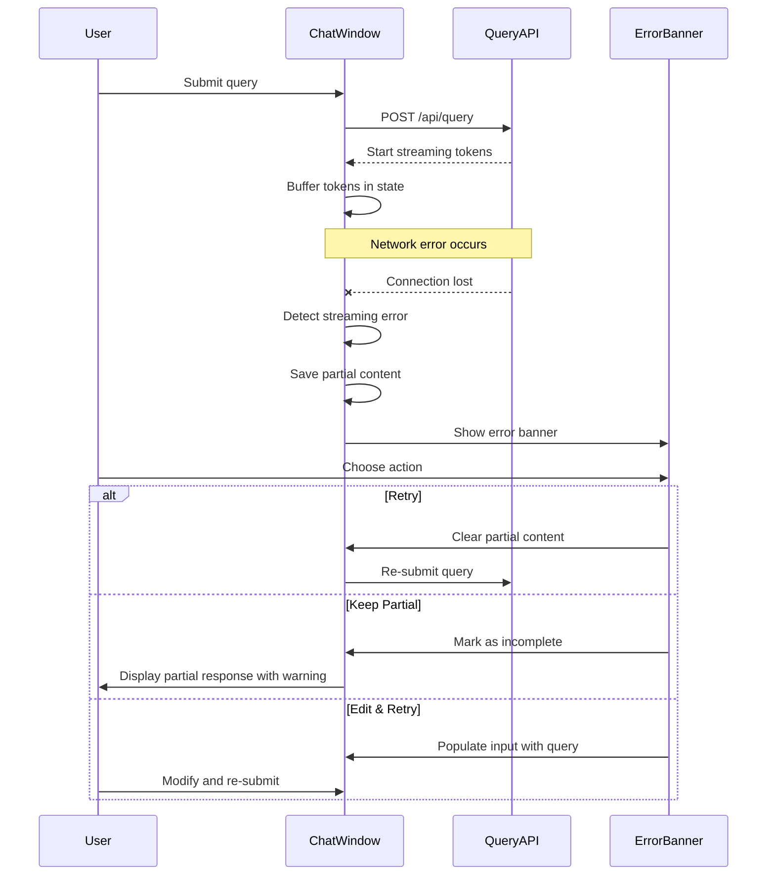

# Design Document: UX & Feature Improvements

## Overview

This design document outlines six UX enhancements for the Data Vault Knowledge Assistant to improve user experience, data management, and system resilience. The improvements focus on conversation portability, document management efficiency, query assistance, retrieval quality control, error recovery, and mobile accessibility.

The base application uses Next.js 14, React, Supabase (PostgreSQL + pgvector), HuggingFace embeddings (all-MiniLM-L6-v2), and Groq LLM (LLaMA 3.1 8B). These enhancements integrate seamlessly with the existing architecture without requiring major refactoring.

### Enhancement Summary

1. **Conversation Export**: Export chat history to Markdown or PDF format for documentation and sharing
2. **Document Re-ingestion**: Re-index existing documents without re-uploading files
3. **Query History**: localStorage-backed query suggestions based on user's past queries
4. **Similarity Threshold Slider**: UI control to filter retrieval results by confidence score
5. **Streaming Error Recovery**: Preserve partial content when streaming fails mid-response
6. **Mobile Layout**: Responsive admin panel and chat interface for mobile devices

## Architecture

### System Context Diagram

```mermaid
graph TB
    subgraph "Browser"
        UI[Chat Interface]
        Admin[Admin Panel]
        Storage[localStorage]
    end
    
    subgraph "Next.js API Routes"
        Query[/api/query]
        Export[/api/export]
        Reindex[/api/reindex]
    end
    
    subgraph "External Services"
        HF[HuggingFace API]
        Groq[Groq LLM]
        PDF[PDF Generation Service]
    end
    
    subgraph "Supabase"
        DB[(PostgreSQL + pgvector)]
    end
    
    UI -->|Query with threshold| Query
    UI -->|Export request| Export
    UI -->|Read/Write history| Storage
    Admin -->|Re-index document| Reindex
    
    Query -->|Retrieve chunks| DB
    Query -->|Generate response| Groq
    Export -->|Generate PDF| PDF
    Reindex -->|Generate embeddings| HF
    Reindex -->|Update chunks| DB
```

### Component Architecture



## Components and Interfaces

### 1. Conversation Export (Markdown/PDF)

**Purpose**: Enable users to export conversation history for documentation, sharing, or archival purposes.

**Interface**:

```typescript
interface ExportOptions {
  format: 'markdown' | 'pdf';
  includeTimestamps: boolean;
  includeSources: boolean;
  includeMetadata: boolean;
}

interface ExportRequest {
  messages: ChatMessage[];
  options: ExportOptions;
}

interface ExportResponse {
  success: boolean;
  downloadUrl?: string;
  error?: string;
}

// Component API
function ExportButton({ messages }: { messages: ChatMessage[] }): JSX.Element

// API endpoint
async function exportConversation(req: ExportRequest): Promise<ExportResponse>
```

**Responsibilities**:
- Render export button in chat interface
- Display format selection modal (Markdown/PDF)
- Generate formatted export content
- Trigger browser download
- Handle export errors gracefully

**Implementation Details**:

Markdown Export (Client-side):
- Format messages with role indicators
- Include source citations as footnotes
- Add metadata header (date, document count)
- Use browser download API

PDF Export (Server-side):
- POST messages to `/api/export`
- Server generates PDF using library (e.g., jsPDF, Puppeteer)
- Return signed URL or base64 data
- Client triggers download

**UI Location**: Floating action button in chat header, visible when messages exist


### 2. Document Re-ingestion

**Purpose**: Allow administrators to re-index existing documents without re-uploading files, useful for embedding model updates or chunking strategy changes.

**Interface**:

```typescript
interface ReindexRequest {
  documentId: string;
  options?: {
    chunkSize?: number;
    overlap?: number;
    forceReEmbed?: boolean;
  };
}

interface ReindexResponse {
  success: boolean;
  documentId: string;
  oldChunkCount: number;
  newChunkCount: number;
  message: string;
}

interface ReindexProgress {
  stage: 'fetching' | 'chunking' | 'embedding' | 'storing' | 'complete';
  progress: number; // 0-100
  message: string;
}

// Component API
function ReindexButton({ document }: { document: Document }): JSX.Element

// API endpoint
async function reindexDocument(req: ReindexRequest): Promise<ReindexResponse>
```

**Responsibilities**:
- Display re-index button for each document in admin panel
- Show progress indicator during re-indexing
- Fetch original document content from storage
- Re-chunk document with current/custom settings
- Generate new embeddings
- Replace old chunks in database (transaction)
- Update document metadata

**Implementation Flow**:

1. User clicks "Re-index" button on document
2. Confirmation modal shows current vs new settings
3. API fetches document content from `documents` table or file storage
4. Re-chunk content using current chunker settings
5. Generate embeddings for new chunks
6. Begin database transaction:
   - Delete old chunks for document
   - Insert new chunks with embeddings
   - Update document `chunk_count` and `updated_at`
7. Commit transaction
8. Return success response with statistics

**Storage Consideration**: Original document content must be stored. Options:
- Store full text in `documents.content` column (TEXT)
- Store file in Supabase Storage bucket
- Recommended: Add `content` column to `documents` table

**UI Location**: Dropdown menu on each document row in admin panel


### 3. Query History (localStorage-backed suggestions)

**Purpose**: Provide query suggestions based on user's past queries to improve discoverability and reduce typing.

**Interface**:

```typescript
interface QueryHistoryEntry {
  query: string;
  timestamp: number;
  resultCount?: number;
}

interface QueryHistoryManager {
  addQuery(query: string, resultCount?: number): void;
  getRecentQueries(limit?: number): QueryHistoryEntry[];
  searchHistory(prefix: string): QueryHistoryEntry[];
  clearHistory(): void;
}

// Component API
function QueryHistoryDropdown({ 
  onSelectQuery: (query: string) => void 
}): JSX.Element

// localStorage key
const QUERY_HISTORY_KEY = 'dv-assistant-query-history';
```

**Responsibilities**:
- Store queries in localStorage after successful submission
- Display dropdown with recent queries when input is focused
- Filter suggestions based on current input (prefix match)
- Limit storage to last 50 queries
- Provide clear history option
- Handle localStorage quota errors gracefully

**Implementation Details**:

Storage Format:
```typescript
interface StoredHistory {
  version: 1;
  queries: QueryHistoryEntry[];
}
```

Behavior:
- Show dropdown on input focus (if history exists)
- Filter suggestions as user types
- Click suggestion to populate input
- Store query after successful response (not on error)
- Deduplicate: move existing query to top if re-submitted
- Prune old entries when limit exceeded (FIFO)

**UI Location**: Dropdown below query input field, appears on focus


### 4. Similarity Threshold Slider

**Purpose**: Give users control over retrieval quality by filtering chunks below a confidence threshold.

**Interface**:

```typescript
interface SimilarityThresholdConfig {
  threshold: number; // 0.0 - 1.0
  enabled: boolean;
}

interface ThresholdSliderProps {
  value: number;
  onChange: (value: number) => void;
  onToggle: (enabled: boolean) => void;
}

// Component API
function SimilarityThresholdSlider(props: ThresholdSliderProps): JSX.Element

// Modified QueryRequest
interface QueryRequest {
  query: string;
  doc_type_filter?: string | null;
  top_k?: number;
  similarity_threshold?: number; // NEW: filter chunks below this score
  chat_history?: Array<{ role: string; content: string }>;
}
```

**Responsibilities**:
- Display slider control in chat interface
- Allow users to set threshold (0.0 - 1.0)
- Persist threshold preference in localStorage
- Send threshold to query API
- Filter retrieved chunks on server-side
- Display warning if no chunks meet threshold
- Show chunk count and similarity scores in UI

**Implementation Details**:

UI Design:
- Slider with labels: "Relaxed (0.3)" to "Strict (0.8)"
- Default: 0.3 (current implicit threshold)
- Toggle to enable/disable filtering
- Visual indicator showing how many chunks passed threshold

Server-side Filtering:
```typescript
// In /api/query route
const filteredChunks = matchedChunks.filter(
  chunk => chunk.similarity >= (similarity_threshold || 0.0)
);

if (filteredChunks.length === 0) {
  return {
    type: 'error',
    error: 'No documents meet the similarity threshold. Try lowering the threshold or rephrasing your query.'
  };
}
```

**UI Location**: Collapsible panel in filter bar, next to document type filter


### 5. Streaming Error Recovery

**Purpose**: Preserve partial response content when streaming fails mid-response, improving user experience during network issues.

**Interface**:

```typescript
interface StreamingState {
  messageId: string;
  partialContent: string;
  sources: Source[];
  isRecoverable: boolean;
  error?: string;
}

interface ErrorRecoveryManager {
  savePartialContent(messageId: string, content: string, sources: Source[]): void;
  getPartialContent(messageId: string): StreamingState | null;
  clearPartialContent(messageId: string): void;
  retryFromPartial(messageId: string): Promise<void>;
}

// Component API
function StreamingErrorBanner({ 
  messageId: string;
  partialContent: string;
  onRetry: () => void;
  onKeep: () => void;
}): JSX.Element
```

**Responsibilities**:
- Buffer streamed tokens in component state
- Detect streaming errors (connection loss, timeout)
- Preserve partial content in message state
- Display error banner with recovery options
- Allow user to retry from beginning or keep partial content
- Mark partial responses visually (warning icon)

**Implementation Details**:

Error Detection:
- EventSource `onerror` event
- Timeout after 60s without tokens
- Incomplete response (no 'done' event)

Recovery Options:
1. **Retry**: Clear partial content, re-submit query
2. **Keep Partial**: Mark message as incomplete, allow continuation
3. **Edit & Retry**: Pre-populate input with original query for modification

UI Behavior:
```typescript
// In ChatWindow component
const [streamingErrors, setStreamingErrors] = useState<Map<string, StreamingState>>(new Map());

// On streaming error
catch (error) {
  setStreamingErrors(prev => new Map(prev).set(messageId, {
    messageId,
    partialContent: currentContent,
    sources: currentSources,
    isRecoverable: true,
    error: error.message
  }));
  
  // Keep partial content in message
  setMessages(prev => prev.map(m => 
    m.id === messageId 
      ? { ...m, content: currentContent, isStreaming: false, hasError: true }
      : m
  ));
}
```

**UI Location**: Error banner appears above affected message with action buttons


### 6. Mobile Layout

**Purpose**: Make the admin panel and chat interface fully functional on mobile devices (phones and tablets).

**Interface**:

```typescript
interface ResponsiveBreakpoints {
  mobile: '0px - 640px';
  tablet: '641px - 1024px';
  desktop: '1025px+';
}

interface MobileLayoutProps {
  children: React.ReactNode;
  variant: 'chat' | 'admin';
}

// Component API
function MobileLayout({ children, variant }: MobileLayoutProps): JSX.Element

// Responsive utilities
function useIsMobile(): boolean
function useBreakpoint(): 'mobile' | 'tablet' | 'desktop'
```

**Responsibilities**:
- Detect device viewport size
- Apply responsive layouts using Tailwind breakpoints
- Optimize touch interactions (larger tap targets)
- Adjust component spacing and sizing
- Handle mobile-specific interactions (swipe, pinch)
- Ensure text readability on small screens

**Implementation Details**:

Chat Interface Mobile Adaptations:
- Stack layout (no sidebars)
- Collapsible filter bar
- Floating action button for export
- Bottom-anchored input with keyboard handling
- Swipe to dismiss suggestions
- Larger message bubbles
- Simplified source citations (expandable)

Admin Panel Mobile Adaptations:
- Single-column document list
- Drawer-based navigation
- Touch-friendly upload area
- Simplified document actions (swipe or long-press)
- Modal-based re-index configuration
- Responsive table → card layout

Tailwind Responsive Classes:
```typescript
// Example responsive styling
<div className="
  flex flex-col          // Mobile: stack vertically
  md:flex-row            // Tablet+: horizontal layout
  gap-2 md:gap-4         // Smaller gaps on mobile
  p-3 md:p-6             // Less padding on mobile
  text-sm md:text-base   // Smaller text on mobile
">
```

Touch Optimization:
- Minimum tap target: 44x44px (iOS guideline)
- Increased button padding
- Larger slider handles
- Swipe gestures for navigation
- Pull-to-refresh for document list

**UI Location**: Applied globally via responsive layout wrapper


## Data Models

### Database Schema Changes

#### Modified `documents` table

```sql
-- Add content column for re-ingestion support
alter table documents add column if not exists content text;
alter table documents add column if not exists updated_at timestamptz default now();

-- Add index for updated_at queries
create index if not exists idx_documents_updated_at on documents(updated_at);
```

**New Fields**:
- `content`: Full extracted text content (enables re-ingestion without file)
- `updated_at`: Timestamp of last re-indexing operation

#### New `query_history` table (optional server-side storage)

```sql
-- Optional: server-side query history for analytics
create table if not exists query_history (
  id          uuid primary key default gen_random_uuid(),
  query_text  text not null,
  user_id     text,                      -- Optional: for multi-user support
  result_count int,
  threshold   float,
  doc_type_filter text,
  created_at  timestamptz default now()
);

create index if not exists idx_query_history_created_at on query_history(created_at);
create index if not exists idx_query_history_user_id on query_history(user_id);
```

**Purpose**: Server-side query history for analytics and cross-device sync (optional enhancement)

### localStorage Schema

#### Query History Storage

```typescript
interface QueryHistoryStorage {
  version: 1;
  queries: Array<{
    query: string;
    timestamp: number;
    resultCount?: number;
  }>;
  maxEntries: 50;
}

// localStorage key: 'dv-assistant-query-history'
```

#### User Preferences Storage

```typescript
interface UserPreferences {
  version: 1;
  similarityThreshold: {
    enabled: boolean;
    value: number; // 0.0 - 1.0
  };
  exportDefaults: {
    format: 'markdown' | 'pdf';
    includeTimestamps: boolean;
    includeSources: boolean;
  };
  theme?: 'light' | 'dark'; // Future enhancement
}

// localStorage key: 'dv-assistant-preferences'
```

### TypeScript Type Definitions

```typescript
// Export types
export interface ExportOptions {
  format: 'markdown' | 'pdf';
  includeTimestamps: boolean;
  includeSources: boolean;
  includeMetadata: boolean;
}

export interface ExportRequest {
  messages: ChatMessage[];
  options: ExportOptions;
}

export interface ExportResponse {
  success: boolean;
  downloadUrl?: string;
  filename?: string;
  error?: string;
}

// Re-index types
export interface ReindexRequest {
  documentId: string;
  options?: {
    chunkSize?: number;
    overlap?: number;
    forceReEmbed?: boolean;
  };
}

export interface ReindexResponse {
  success: boolean;
  documentId: string;
  oldChunkCount: number;
  newChunkCount: number;
  message: string;
}

export interface ReindexProgress {
  stage: 'fetching' | 'chunking' | 'embedding' | 'storing' | 'complete';
  progress: number;
  message: string;
}

// Query history types
export interface QueryHistoryEntry {
  query: string;
  timestamp: number;
  resultCount?: number;
}

// Similarity threshold types
export interface SimilarityThresholdConfig {
  threshold: number;
  enabled: boolean;
}

// Streaming error recovery types
export interface StreamingState {
  messageId: string;
  partialContent: string;
  sources: Source[];
  isRecoverable: boolean;
  error?: string;
}

// Mobile layout types
export type Breakpoint = 'mobile' | 'tablet' | 'desktop';

export interface ResponsiveConfig {
  breakpoint: Breakpoint;
  isMobile: boolean;
  isTablet: boolean;
  isDesktop: boolean;
}
```


## Sequence Diagrams

### 1. Conversation Export Flow



### 2. Document Re-ingestion Flow



### 3. Query with Similarity Threshold Flow



### 4. Streaming Error Recovery Flow




## Error Handling

### Export Errors

**Scenario 1: PDF Generation Failure**
- **Condition**: Server-side PDF generation fails (library error, memory limit)
- **Response**: Return 500 error with message "PDF generation failed"
- **Recovery**: Suggest Markdown export as alternative
- **User Experience**: Show error toast, keep export modal open with Markdown option highlighted

**Scenario 2: Export Too Large**
- **Condition**: Conversation exceeds reasonable size (>1000 messages, >10MB)
- **Response**: Return 413 error with message "Conversation too large to export"
- **Recovery**: Suggest exporting in chunks or Markdown only
- **User Experience**: Show warning with file size estimate before export

**Scenario 3: Browser Download Blocked**
- **Condition**: Browser blocks automatic download (popup blocker)
- **Response**: Detect download failure, show manual download link
- **Recovery**: Provide alternative download button
- **User Experience**: Show notification with manual download link

### Re-ingestion Errors

**Scenario 1: Document Content Not Found**
- **Condition**: Document record exists but content column is NULL
- **Response**: Return 404 error with message "Original content not available"
- **Recovery**: Suggest re-uploading document
- **User Experience**: Show error message, hide re-index button, show upload button

**Scenario 2: Embedding API Failure**
- **Condition**: HuggingFace API returns error during re-embedding
- **Response**: Return 500 error, rollback transaction
- **Recovery**: Retry with exponential backoff (3 attempts)
- **User Experience**: Show progress with retry indicator, final error if all attempts fail

**Scenario 3: Transaction Rollback**
- **Condition**: Database error during chunk replacement
- **Response**: Rollback transaction, return 500 error
- **Recovery**: Original chunks remain intact, no data loss
- **User Experience**: Show error message, document remains in original state

### Query History Errors

**Scenario 1: localStorage Quota Exceeded**
- **Condition**: localStorage full (typically 5-10MB limit)
- **Response**: Catch QuotaExceededError, prune old entries
- **Recovery**: Remove oldest 50% of history, retry save
- **User Experience**: Silent recovery, show warning if pruning fails

**Scenario 2: localStorage Disabled**
- **Condition**: User has disabled localStorage or in private browsing
- **Response**: Detect storage unavailable, disable history feature
- **Recovery**: Feature gracefully degrades, no errors shown
- **User Experience**: History dropdown doesn't appear, no error messages

**Scenario 3: Corrupted History Data**
- **Condition**: localStorage contains invalid JSON or wrong schema
- **Response**: Catch parse error, clear corrupted data
- **Recovery**: Initialize fresh history storage
- **User Experience**: Silent recovery, history starts fresh

### Similarity Threshold Errors

**Scenario 1: No Chunks Meet Threshold**
- **Condition**: All retrieved chunks have similarity < threshold
- **Response**: Return empty result set with specific error message
- **Recovery**: Suggest lowering threshold or rephrasing query
- **User Experience**: Show warning banner with threshold adjustment suggestion

**Scenario 2: Threshold Too Strict**
- **Condition**: User sets threshold > 0.9 (unrealistic for most queries)
- **Response**: Show warning before query submission
- **Recovery**: Suggest recommended range (0.3 - 0.7)
- **User Experience**: Warning tooltip on slider, allow override

### Streaming Error Recovery

**Scenario 1: Network Timeout**
- **Condition**: No tokens received for 30 seconds
- **Response**: Close stream, preserve partial content
- **Recovery**: Offer retry or keep partial
- **User Experience**: Error banner with retry button

**Scenario 2: Server Error Mid-Stream**
- **Condition**: Server returns error event during streaming
- **Response**: Parse error message, preserve partial content
- **Recovery**: Display error reason, offer retry
- **User Experience**: Error banner with specific error message

**Scenario 3: Incomplete Response**
- **Condition**: Stream closes without 'done' event
- **Response**: Detect incomplete state, mark message
- **Recovery**: Offer retry or keep partial
- **User Experience**: Warning icon on message, error banner

### Mobile Layout Errors

**Scenario 1: Viewport Too Small**
- **Condition**: Screen width < 320px (very small devices)
- **Response**: Show minimum width warning
- **Recovery**: Suggest landscape orientation or larger device
- **User Experience**: Overlay message with orientation icon

**Scenario 2: Touch Event Conflicts**
- **Condition**: Swipe gestures conflict with browser navigation
- **Response**: Detect conflict, disable conflicting gestures
- **Recovery**: Fall back to tap-only interactions
- **User Experience**: Seamless fallback, no error shown


## Testing Strategy

### Unit Testing

**Export Functionality**:
- Test Markdown formatting with various message types
- Test PDF generation with mock messages
- Test export options (timestamps, sources, metadata)
- Test download trigger mechanism
- Test error handling for large exports

**Re-ingestion**:
- Test document content retrieval
- Test re-chunking with different settings
- Test embedding generation for re-indexed chunks
- Test transaction rollback on failure
- Test chunk count updates

**Query History**:
- Test localStorage read/write operations
- Test history pruning when limit exceeded
- Test query deduplication
- Test prefix search filtering
- Test graceful degradation when localStorage unavailable

**Similarity Threshold**:
- Test chunk filtering at various thresholds
- Test empty result handling
- Test threshold persistence in localStorage
- Test UI slider value updates
- Test API integration with threshold parameter

**Streaming Error Recovery**:
- Test partial content buffering
- Test error detection (timeout, connection loss)
- Test retry mechanism
- Test keep partial functionality
- Test error banner display

**Mobile Layout**:
- Test breakpoint detection
- Test responsive class application
- Test touch event handling
- Test mobile-specific UI components
- Test viewport size warnings

### Integration Testing

**End-to-End Export Flow**:
```typescript
describe('Conversation Export', () => {
  it('should export conversation as Markdown', async () => {
    // Setup: Create conversation with messages
    const messages = [
      { role: 'user', content: 'What is a Hub?' },
      { role: 'assistant', content: 'A Hub is...', sources: [...] }
    ];
    
    // Action: Trigger export
    const result = await exportConversation({
      messages,
      options: { format: 'markdown', includeTimestamps: true, includeSources: true }
    });
    
    // Assert: Verify Markdown content
    expect(result).toContain('# Conversation Export');
    expect(result).toContain('**User:**');
    expect(result).toContain('**Assistant:**');
    expect(result).toContain('## Sources');
  });
  
  it('should export conversation as PDF', async () => {
    // Test PDF generation via API
    const response = await fetch('/api/export', {
      method: 'POST',
      body: JSON.stringify({ messages, options: { format: 'pdf' } })
    });
    
    expect(response.ok).toBe(true);
    const data = await response.json();
    expect(data.downloadUrl).toBeDefined();
  });
});
```

**End-to-End Re-ingestion Flow**:
```typescript
describe('Document Re-ingestion', () => {
  it('should re-index document with new chunks', async () => {
    // Setup: Upload document
    const docId = await uploadTestDocument();
    const originalChunkCount = await getChunkCount(docId);
    
    // Action: Re-index with different chunk size
    const result = await fetch('/api/reindex', {
      method: 'POST',
      body: JSON.stringify({ 
        documentId: docId, 
        options: { chunkSize: 600 } 
      })
    });
    
    const data = await result.json();
    
    // Assert: Verify new chunk count
    expect(data.success).toBe(true);
    expect(data.newChunkCount).not.toBe(originalChunkCount);
    
    // Verify chunks in database
    const newChunks = await getChunks(docId);
    expect(newChunks.length).toBe(data.newChunkCount);
  });
});
```

**Query with Threshold Integration**:
```typescript
describe('Similarity Threshold', () => {
  it('should filter chunks below threshold', async () => {
    // Setup: Index test document
    await uploadTestDocument();
    
    // Action: Query with high threshold
    const response = await fetch('/api/query', {
      method: 'POST',
      body: JSON.stringify({ 
        query: 'test query', 
        similarity_threshold: 0.7 
      })
    });
    
    // Assert: Verify filtering
    const events = await parseSSEStream(response.body);
    const sourcesEvent = events.find(e => e.type === 'sources');
    
    expect(sourcesEvent.sources.every(s => s.similarity >= 0.7)).toBe(true);
  });
});
```

### Property-Based Testing

**Property 1: Export Idempotence**
```typescript
// Feature: ux-feature-improvements, Property 1: Export Idempotence
test('exporting same conversation twice produces identical output', () => {
  fc.assert(
    fc.property(
      fc.array(fc.record({
        role: fc.constantFrom('user', 'assistant'),
        content: fc.string({ minLength: 1, maxLength: 500 })
      }), { minLength: 1, maxLength: 20 }),
      (messages) => {
        const export1 = exportToMarkdown(messages, defaultOptions);
        const export2 = exportToMarkdown(messages, defaultOptions);
        
        expect(export1).toBe(export2);
      }
    ),
    { numRuns: 100 }
  );
});
```

**Property 2: Re-ingestion Preserves Content**
```typescript
// Feature: ux-feature-improvements, Property 2: Re-ingestion Content Preservation
test('re-ingestion preserves all document content', () => {
  fc.assert(
    fc.property(
      fc.string({ minLength: 1000, maxLength: 10000 }),
      async (documentContent) => {
        // Original chunking
        const originalChunks = chunkText(documentContent);
        const originalCombined = originalChunks.map(c => c.content).join('');
        
        // Re-ingestion chunking
        const reindexedChunks = chunkText(documentContent);
        const reindexedCombined = reindexedChunks.map(c => c.content).join('');
        
        // Content should be preserved (accounting for overlap)
        expect(reindexedCombined).toContain(documentContent.slice(0, 100));
        expect(reindexedCombined).toContain(documentContent.slice(-100));
      }
    ),
    { numRuns: 50 }
  );
});
```

**Property 3: Query History Ordering**
```typescript
// Feature: ux-feature-improvements, Property 3: Query History Chronological Order
test('query history maintains chronological order', () => {
  fc.assert(
    fc.property(
      fc.array(fc.string({ minLength: 1, maxLength: 100 }), { minLength: 2, maxLength: 50 }),
      (queries) => {
        const history = new QueryHistoryManager();
        
        // Add queries with increasing timestamps
        queries.forEach((q, i) => {
          history.addQuery(q);
        });
        
        const recent = history.getRecentQueries();
        
        // Verify chronological order (most recent first)
        for (let i = 0; i < recent.length - 1; i++) {
          expect(recent[i].timestamp).toBeGreaterThanOrEqual(recent[i + 1].timestamp);
        }
      }
    ),
    { numRuns: 100 }
  );
});
```

**Property 4: Threshold Filtering Monotonicity**
```typescript
// Feature: ux-feature-improvements, Property 4: Threshold Filtering Monotonicity
test('higher threshold returns subset of lower threshold results', () => {
  fc.assert(
    fc.property(
      fc.array(fc.record({
        id: fc.uuid(),
        similarity: fc.float({ min: 0, max: 1 })
      }), { minLength: 10, maxLength: 50 }),
      fc.float({ min: 0.3, max: 0.7 }),
      (chunks, threshold1) => {
        const threshold2 = threshold1 + 0.1;
        
        const filtered1 = chunks.filter(c => c.similarity >= threshold1);
        const filtered2 = chunks.filter(c => c.similarity >= threshold2);
        
        // filtered2 should be subset of filtered1
        expect(filtered2.length).toBeLessThanOrEqual(filtered1.length);
        
        // All IDs in filtered2 should be in filtered1
        const ids1 = new Set(filtered1.map(c => c.id));
        filtered2.forEach(c => {
          expect(ids1.has(c.id)).toBe(true);
        });
      }
    ),
    { numRuns: 100 }
  );
});
```

**Property 5: Partial Content Preservation**
```typescript
// Feature: ux-feature-improvements, Property 5: Streaming Partial Content Preservation
test('streaming error preserves all received tokens', () => {
  fc.assert(
    fc.property(
      fc.array(fc.string({ minLength: 1, maxLength: 50 }), { minLength: 1, maxLength: 100 }),
      (tokens) => {
        const buffer = new StreamingBuffer();
        
        // Simulate streaming tokens
        tokens.forEach(token => buffer.append(token));
        
        // Simulate error
        const partial = buffer.getPartialContent();
        
        // Verify all tokens preserved
        const expected = tokens.join('');
        expect(partial).toBe(expected);
      }
    ),
    { numRuns: 100 }
  );
});
```

### Test Coverage Goals

- **Line Coverage**: >85% for new components
- **Branch Coverage**: >80% for error handling paths
- **Integration Coverage**: All 6 features have end-to-end tests
- **Property Tests**: Minimum 5 properties covering core invariants


## Performance Considerations

### Export Performance

**Markdown Export**:
- Client-side generation: <100ms for 100 messages
- Memory efficient: streaming string concatenation
- No server round-trip required

**PDF Export**:
- Server-side generation: 1-3 seconds for 100 messages
- Memory consideration: limit to 500 messages per export
- Async processing: return immediately with job ID for large exports
- Caching: cache generated PDFs for 5 minutes (same conversation)

**Optimization**:
- Lazy load export modal (code splitting)
- Debounce export button (prevent double-clicks)
- Show progress indicator for PDF generation
- Compress PDF output (reduce file size by 30-50%)

### Re-ingestion Performance

**Chunking Performance**:
- Re-chunk 10MB document: ~500ms
- Parallel processing: chunk while fetching embeddings
- Progress updates: emit events every 10% completion

**Embedding Performance**:
- Batch size: 10 chunks per API call (balance latency/throughput)
- Parallel requests: 3 concurrent batches (respect rate limits)
- Estimated time: 100 chunks = ~10 seconds
- Progress indicator: show chunk count and percentage

**Database Performance**:
- Transaction overhead: <100ms for 100 chunks
- Bulk insert: use batch INSERT (not individual INSERTs)
- Index rebuild: automatic, no manual VACUUM needed
- Locking: row-level locks, no table locks

**Optimization**:
- Cache document content in memory during re-index
- Reuse embedding API client (connection pooling)
- Use database prepared statements
- Background job for large documents (>1000 chunks)

### Query History Performance

**localStorage Performance**:
- Read: <1ms for 50 entries
- Write: <5ms for 50 entries
- Search: <10ms for prefix match on 50 entries
- No network latency (local storage)

**Memory Usage**:
- 50 queries × 100 chars avg = ~5KB
- Negligible impact on browser memory
- Automatic pruning prevents unbounded growth

**Optimization**:
- Debounce search input (300ms delay)
- Limit displayed suggestions to 10 (even if more match)
- Lazy render dropdown (only when focused)
- Use virtual scrolling for large history (future)

### Similarity Threshold Performance

**Filtering Performance**:
- Server-side filter: <1ms for 100 chunks
- No additional database query (filter in-memory)
- Minimal CPU overhead (simple comparison)

**UI Performance**:
- Slider updates: <16ms (60fps)
- Debounce slider changes (500ms before query)
- Persist threshold: async localStorage write (non-blocking)

**Optimization**:
- Filter after retrieval (not in SQL query)
- Cache threshold value in component state
- Batch threshold updates (prevent rapid re-queries)

### Streaming Error Recovery Performance

**Buffer Performance**:
- Token buffering: <1ms per token
- Memory usage: ~10KB for 1000 tokens
- No performance impact on streaming

**Error Detection**:
- Timeout check: every 5 seconds (low overhead)
- Connection monitoring: browser native (no overhead)
- State updates: React batching (efficient)

**Optimization**:
- Use React.memo for error banner (prevent re-renders)
- Debounce retry button (prevent rapid retries)
- Clear old error states (prevent memory leaks)

### Mobile Layout Performance

**Responsive Performance**:
- CSS media queries: native browser (no JS overhead)
- Tailwind classes: compiled at build time (no runtime cost)
- Breakpoint detection: single resize listener (debounced)

**Touch Performance**:
- Touch events: native browser handling
- Gesture detection: passive event listeners (no scroll blocking)
- Animation: CSS transforms (GPU accelerated)

**Optimization**:
- Lazy load mobile-specific components
- Reduce animations on low-end devices (prefers-reduced-motion)
- Optimize images for mobile (responsive images)
- Minimize layout shifts (CLS optimization)

### Overall Performance Targets

| Feature | Target | Measurement |
|---------|--------|-------------|
| Markdown Export | <100ms | Time to download |
| PDF Export | <3s | Time to download |
| Re-ingestion (100 chunks) | <15s | Total operation time |
| Query History Search | <10ms | Search response time |
| Threshold Filter | <1ms | Filter execution time |
| Error Recovery | <50ms | Error detection time |
| Mobile Layout | <16ms | Frame render time |


## Security Considerations

### Export Security

**Data Exposure**:
- Exports contain full conversation history (sensitive information)
- No authentication required for export (session-based)
- PDF generation on server (potential for injection attacks)

**Mitigations**:
- Sanitize message content before PDF generation (prevent XSS)
- Limit export size (prevent DoS via large exports)
- Rate limit export endpoint (5 exports per minute per IP)
- No persistent storage of exports (generate on-demand)
- Use secure PDF library (avoid known vulnerabilities)

**Recommendations**:
- Add optional password protection for PDF exports
- Implement export audit logging (who exported what, when)
- Consider watermarking exports with user ID/timestamp

### Re-ingestion Security

**Access Control**:
- Re-ingestion requires admin authentication
- Admin password verified server-side (not client-side)
- Document content stored in database (access controlled)

**Injection Risks**:
- Document content could contain malicious text
- Embedding API receives untrusted content
- Database queries use document content

**Mitigations**:
- Validate document ID (UUID format)
- Parameterized database queries (prevent SQL injection)
- Sanitize content before embedding (remove control characters)
- Rate limit re-ingestion (1 per document per minute)
- Transaction rollback on any error (prevent partial state)

**Recommendations**:
- Add re-ingestion audit log (track all re-index operations)
- Implement document version history (rollback capability)
- Require confirmation for re-ingestion (prevent accidental triggers)

### Query History Security

**Privacy Concerns**:
- Query history stored in browser (accessible to user)
- No encryption of localStorage data
- Queries may contain sensitive information
- Shared device risk (other users can see history)

**Mitigations**:
- localStorage is origin-scoped (not accessible cross-domain)
- Clear history option available to users
- No server-side storage of queries (privacy by default)
- Session-only mode option (disable persistence)

**Recommendations**:
- Add "Clear History" button in UI
- Implement optional encryption for localStorage (future)
- Add privacy notice about local storage usage
- Consider incognito mode detection (disable history)

### Similarity Threshold Security

**Minimal Risk**:
- Threshold is a numeric filter (no injection risk)
- Client-side preference (no server-side impact)
- No sensitive data exposure

**Mitigations**:
- Validate threshold range (0.0 - 1.0) on server
- Sanitize threshold value before database query
- Rate limit queries (prevent threshold scanning attacks)

### Streaming Error Recovery Security

**Information Disclosure**:
- Error messages may reveal system details
- Partial content may contain sensitive information
- Retry mechanism could amplify DoS attacks

**Mitigations**:
- Sanitize error messages (remove stack traces, paths)
- Rate limit retries (3 retries per message)
- Timeout retries (prevent infinite retry loops)
- Log errors server-side (for debugging, not client exposure)

**Recommendations**:
- Implement exponential backoff for retries
- Add CAPTCHA for repeated failures (prevent abuse)
- Monitor retry patterns (detect potential attacks)

### Mobile Layout Security

**Touch Hijacking**:
- Touch events could be intercepted (clickjacking)
- Swipe gestures could trigger unintended actions
- Mobile browsers have different security models

**Mitigations**:
- Use Content Security Policy (CSP) headers
- Implement frame-busting (prevent iframe embedding)
- Validate touch events (prevent synthetic events)
- Use secure HTTPS (prevent MITM attacks)

**Recommendations**:
- Add touch event validation (distinguish real vs synthetic)
- Implement gesture confirmation for sensitive actions
- Test on multiple mobile browsers (security variations)

### General Security Best Practices

**Authentication**:
- Admin panel requires password authentication
- Session-based authentication (no tokens in localStorage)
- Password verification server-side only

**Input Validation**:
- Validate all user inputs (client and server)
- Sanitize before storage and display
- Use parameterized queries (prevent SQL injection)
- Escape HTML content (prevent XSS)

**Rate Limiting**:
- Export: 5 per minute per IP
- Re-ingestion: 1 per document per minute
- Query: 20 per minute per IP (existing)
- Retry: 3 per message

**Logging & Monitoring**:
- Log all admin actions (re-ingestion, document deletion)
- Log export operations (audit trail)
- Monitor for suspicious patterns (rapid retries, large exports)
- Alert on security events (failed auth, rate limit exceeded)

**Dependencies**:
- Keep all dependencies updated (npm audit)
- Use trusted libraries for PDF generation
- Verify integrity of third-party code (SRI)
- Regular security audits (quarterly)


## Dependencies

### New Dependencies

**Export Functionality**:
- `jspdf` (^2.5.1): PDF generation library
  - Purpose: Generate PDF exports server-side
  - License: MIT
  - Size: ~500KB
  - Alternative: `puppeteer` (heavier, more features)

- `markdown-it` (^14.0.0): Markdown parser/renderer
  - Purpose: Format Markdown exports with proper syntax
  - License: MIT
  - Size: ~100KB
  - Alternative: `marked` (lighter, fewer features)

**Mobile Layout**:
- `react-use` (^17.4.0): React hooks library
  - Purpose: useBreakpoint, useWindowSize hooks
  - License: Unlicense
  - Size: ~50KB
  - Alternative: Custom hooks (no dependency)

**Optional Dependencies**:
- `file-saver` (^2.0.5): Client-side file download
  - Purpose: Trigger downloads in older browsers
  - License: MIT
  - Size: ~5KB
  - Note: Modern browsers support native download API

### Existing Dependencies (No Changes)

- `next` (14.x): React framework
- `react` (18.x): UI library
- `@supabase/supabase-js`: Database client
- `groq-sdk`: LLM API client
- `tailwindcss`: CSS framework
- `react-markdown`: Markdown rendering
- `remark-gfm`: GitHub Flavored Markdown

### Development Dependencies

**Testing**:
- `@testing-library/react`: Component testing
- `@testing-library/user-event`: User interaction simulation
- `jest`: Test framework
- `fast-check`: Property-based testing

**Build Tools**:
- `typescript`: Type checking
- `eslint`: Code linting
- `prettier`: Code formatting

### External Services (No Changes)

- **Supabase**: PostgreSQL + pgvector database
- **HuggingFace API**: Embedding generation
- **Groq API**: LLM inference
- **Vercel**: Hosting and deployment

### Browser APIs Used

**localStorage**:
- Purpose: Query history and user preferences
- Fallback: Feature gracefully degrades if unavailable
- Quota: ~5-10MB (browser-dependent)

**EventSource (SSE)**:
- Purpose: Streaming query responses
- Fallback: Polling (not implemented, would require refactor)
- Support: All modern browsers

**Download API**:
- Purpose: Trigger file downloads
- Fallback: file-saver library for older browsers
- Support: All modern browsers

**ResizeObserver**:
- Purpose: Responsive layout detection
- Fallback: window.matchMedia (CSS media queries)
- Support: All modern browsers

**Touch Events**:
- Purpose: Mobile gesture handling
- Fallback: Mouse events (automatic in most browsers)
- Support: All mobile browsers

### Dependency Management

**Version Pinning**:
- Pin major versions (e.g., `^2.5.1` allows minor/patch updates)
- Lock file committed (package-lock.json)
- Regular updates (monthly dependency review)

**Security**:
- Run `npm audit` before each deployment
- Automated security alerts (GitHub Dependabot)
- Update vulnerable dependencies immediately

**Bundle Size**:
- Monitor bundle size (Next.js built-in analyzer)
- Code splitting for large dependencies (jspdf, markdown-it)
- Tree shaking enabled (remove unused code)
- Target: <500KB total bundle size increase

**Compatibility**:
- Target browsers: Chrome 90+, Firefox 88+, Safari 14+, Edge 90+
- Mobile: iOS 14+, Android 10+
- Node.js: 18.x or higher (for Vercel deployment)


## Correctness Properties

*A property is a characteristic or behavior that should hold true across all valid executions of a system — essentially, a formal statement about what the system should do. Properties serve as the bridge between human-readable specifications and machine-verifiable correctness guarantees.*

### Property 1: Export Content Completeness

*For any* conversation with N messages, the exported content (Markdown or PDF) should contain all N messages with their complete content, preserving the order and role (user/assistant) of each message.

**Validates: Requirements 1.3, 1.4**

### Property 2: Export Idempotence

*For any* conversation, exporting the same conversation multiple times with identical options should produce identical output content (excluding timestamps if not included in options).

**Validates: Requirement 1.7**

### Property 3: Export Options Inclusion

*For any* conversation exported with includeTimestamps or includeSources enabled, the exported output should contain a timestamp or source citation respectively for every applicable message.

**Validates: Requirements 1.5, 1.6**

### Property 4: Re-ingestion Content Preservation

*For any* document, after re-ingestion, the content of the new chunks should cover all content from the original document with no omissions.

**Validates: Requirement 2.7**

### Property 5: Re-ingestion Atomicity

*For any* re-ingestion operation, either all changes (delete old chunks, insert new chunks, update metadata) are committed to the database, or none are committed (transaction rollback on any failure).

**Validates: Requirements 2.4, 2.9**

### Property 6: Query History Chronological Order

*For any* query history, the queries should be ordered by timestamp in descending order (most recent first), and for all consecutive entries i and i+1, timestamp[i] >= timestamp[i+1].

**Validates: Requirements 3.1, 3.5**

### Property 7: Query History Bounded Size

*For any* query history storage, the number of stored queries should never exceed the configured maximum (default 50 entries), with oldest entries removed when the limit is reached.

**Validates: Requirement 3.6**

### Property 8: Query History Deduplication

*For any* query that already exists in history, re-submitting it should result in exactly one entry at the top of the list with no duplicate entries.

**Validates: Requirement 3.7**

### Property 9: Query History Prefix Filtering

*For any* input prefix string P and query history, the filtered suggestions should contain only entries whose query text starts with P, and no entries that do not start with P.

**Validates: Requirement 3.2**

### Property 10: Similarity Threshold Filtering

*For any* query with similarity threshold T, all returned Document_Chunks should have similarity scores greater than or equal to T, and no chunks with scores below T should be returned.

**Validates: Requirement 4.3**

### Property 11: Threshold Monotonicity

*For any* query, if threshold T1 < T2, then the set of chunks returned with threshold T2 should be a subset of the chunks returned with threshold T1.

**Validates: Requirement 4.4**

### Property 12: Partial Content Preservation

*For any* streaming response that fails after receiving N tokens, all N received tokens should be preserved in the Partial_Content buffer with no tokens dropped or reordered.

**Validates: Requirements 5.1, 5.7**

### Property 13: Streaming Error State Consistency

*For any* message that encounters a streaming error, the message state should have hasError set to true and isStreaming set to false, with the Partial_Content remaining accessible.

**Validates: Requirement 5.2**

### Property 14: Mobile Breakpoint Consistency

*For any* viewport width W, the detected breakpoint should be consistent: mobile if W < 641px, tablet if 641px <= W <= 1024px, desktop if W >= 1025px.

**Validates: Requirement 6.1**

### Property 15: Touch Target Size

*For any* interactive element rendered on a mobile viewport, the element's touch target area should be at least 44 by 44 pixels.

**Validates: Requirement 6.4**


## Implementation Approach

### Phase 1: Foundation & Infrastructure (Week 1)

**Goal**: Set up database changes, utilities, and testing infrastructure

**Tasks**:
1. Add `content` and `updated_at` columns to `documents` table
2. Migrate existing documents (backfill content from files if available)
3. Create localStorage utility module with error handling
4. Create responsive breakpoint detection hooks
5. Set up property-based testing infrastructure
6. Create shared TypeScript types for new features
7. Update API route types and validation schemas

**Deliverables**:
- Database schema updated and migrated
- localStorage utilities with graceful degradation
- Responsive hooks (useBreakpoint, useIsMobile)
- Testing infrastructure ready
- Type definitions complete

### Phase 2: Export Functionality (Week 2)

**Goal**: Implement conversation export in Markdown and PDF formats

**Tasks**:
1. Create ExportButton component with modal
2. Implement Markdown export (client-side)
3. Create `/api/export` endpoint for PDF generation
4. Integrate jsPDF library for PDF rendering
5. Add export options UI (timestamps, sources, metadata)
6. Implement download trigger mechanism
7. Write unit tests for export formatting
8. Write integration tests for export API
9. Add export button to chat interface header

**Deliverables**:
- Working Markdown export (client-side)
- Working PDF export (server-side)
- Export options modal
- Tests with >85% coverage
- User documentation

### Phase 3: Document Re-ingestion (Week 2-3)

**Goal**: Enable re-indexing of existing documents

**Tasks**:
1. Create `/api/reindex` endpoint
2. Implement document content retrieval
3. Implement re-chunking with configurable options
4. Implement batch re-embedding
5. Implement transactional chunk replacement
6. Create ReindexButton component with progress indicator
7. Add re-index option to document dropdown menu
8. Write unit tests for re-ingestion logic
9. Write integration tests for full re-index flow
10. Add re-index audit logging

**Deliverables**:
- Working re-ingestion API
- Progress indicator UI
- Transaction safety verified
- Tests with >85% coverage
- Admin documentation

### Phase 4: Query History & Threshold (Week 3)

**Goal**: Implement query suggestions and similarity filtering

**Tasks**:
1. Create QueryHistoryManager class
2. Implement localStorage persistence with error handling
3. Create QueryHistoryDropdown component
4. Integrate dropdown with chat input
5. Create SimilarityThresholdSlider component
6. Update `/api/query` to accept threshold parameter
7. Implement server-side chunk filtering
8. Add threshold persistence to localStorage
9. Write unit tests for history and threshold
10. Write property tests for filtering monotonicity

**Deliverables**:
- Working query history with suggestions
- Working similarity threshold filter
- localStorage persistence
- Tests with >85% coverage
- User guide for threshold usage

### Phase 5: Streaming Error Recovery (Week 4)

**Goal**: Preserve partial content on streaming failures

**Tasks**:
1. Implement streaming buffer in ChatWindow
2. Add error detection logic (timeout, connection loss)
3. Create StreamingErrorBanner component
4. Implement retry mechanism
5. Implement keep partial functionality
6. Add visual indicators for incomplete messages
7. Write unit tests for error detection
8. Write integration tests for recovery flows
9. Test with simulated network failures
10. Add error recovery documentation

**Deliverables**:
- Working error detection
- Working retry and keep partial
- Error banner UI
- Tests with >85% coverage
- Error handling guide

### Phase 6: Mobile Layout (Week 4-5)

**Goal**: Make all interfaces mobile-responsive

**Tasks**:
1. Audit existing components for mobile issues
2. Apply responsive Tailwind classes to ChatWindow
3. Apply responsive classes to DocumentPanel
4. Implement mobile navigation (drawer/tabs)
5. Optimize touch targets (44x44px minimum)
6. Test on real mobile devices (iOS, Android)
7. Implement swipe gestures (optional)
8. Add viewport size warnings
9. Write responsive layout tests
10. Performance testing on mobile devices

**Deliverables**:
- Fully responsive chat interface
- Fully responsive admin panel
- Touch-optimized interactions
- Tests on real devices
- Mobile user guide

### Phase 7: Integration & Polish (Week 5)

**Goal**: Integrate all features and polish UX

**Tasks**:
1. End-to-end testing of all 6 features
2. Cross-feature integration testing
3. Performance optimization (bundle size, load time)
4. Accessibility audit (WCAG 2.1 AA)
5. Browser compatibility testing
6. Security audit and penetration testing
7. User acceptance testing
8. Documentation completion
9. Deployment preparation
10. Monitoring and analytics setup

**Deliverables**:
- All features integrated and working
- Performance benchmarks met
- Accessibility compliance verified
- Security audit passed
- Complete documentation
- Production deployment ready

### Development Guidelines

**Code Organization**:
```
app/
  api/
    export/route.ts         # NEW: Export endpoint
    reindex/route.ts        # NEW: Re-ingestion endpoint
    query/route.ts          # MODIFIED: Add threshold support
  components/
    ChatWindow.tsx          # MODIFIED: Add export, history, threshold, error recovery
    DocumentPanel.tsx       # MODIFIED: Add re-index button
    ExportButton.tsx        # NEW: Export functionality
    ExportModal.tsx         # NEW: Export options
    QueryHistoryDropdown.tsx # NEW: Query suggestions
    SimilarityThresholdSlider.tsx # NEW: Threshold control
    StreamingErrorBanner.tsx # NEW: Error recovery UI
    ReindexButton.tsx       # NEW: Re-ingestion trigger
    MobileLayout.tsx        # NEW: Responsive wrapper

lib/
  export.ts               # NEW: Export utilities
  reindex.ts              # NEW: Re-ingestion logic
  queryHistory.ts         # NEW: localStorage manager
  responsive.ts           # NEW: Breakpoint hooks
  streamingBuffer.ts      # NEW: Error recovery utilities

types.ts                  # MODIFIED: Add new types
```

**Coding Standards**:
- Follow existing code style (ESLint + Prettier)
- TypeScript strict mode
- Comprehensive JSDoc comments
- Error handling at every layer
- Accessibility attributes (ARIA labels)
- Mobile-first responsive design

**Testing Standards**:
- Unit tests for all new functions
- Integration tests for all API endpoints
- Property tests for core invariants
- E2E tests for user flows
- Minimum 85% code coverage
- Test on real devices (not just emulators)

**Performance Standards**:
- Export: <3s for 100 messages
- Re-ingestion: <15s for 100 chunks
- Query history: <10ms search
- Threshold filter: <1ms execution
- Mobile layout: <16ms frame time
- Bundle size: <500KB increase

**Security Standards**:
- Input validation (client and server)
- Output sanitization (prevent XSS)
- Rate limiting on all endpoints
- Audit logging for admin actions
- No sensitive data in localStorage
- HTTPS only (enforced)

### Deployment Strategy

**Staging Deployment**:
1. Deploy to Vercel preview environment
2. Run automated test suite
3. Manual QA testing
4. Performance benchmarking
5. Security scanning
6. Stakeholder review

**Production Deployment**:
1. Feature flags for gradual rollout
2. Monitor error rates and performance
3. Rollback plan ready
4. User communication (changelog)
5. Support team briefing
6. Post-deployment verification

**Rollback Plan**:
- Database migrations are reversible
- Feature flags can disable new features
- Previous deployment can be restored in <5 minutes
- No data loss on rollback (backward compatible)

### Success Metrics

**Functional Metrics**:
- Export success rate >95%
- Re-ingestion success rate >90%
- Query history adoption >50% of users
- Threshold usage >30% of queries
- Error recovery success rate >80%
- Mobile usage >20% of sessions

**Performance Metrics**:
- Export time <3s (p95)
- Re-ingestion time <15s per 100 chunks (p95)
- Query history search <10ms (p99)
- Mobile page load <2s (p95)
- Error recovery time <50ms (p99)

**User Experience Metrics**:
- User satisfaction score >4.0/5.0
- Feature discovery rate >60%
- Mobile bounce rate <30%
- Error recovery completion rate >70%
- Export usage >10% of sessions

